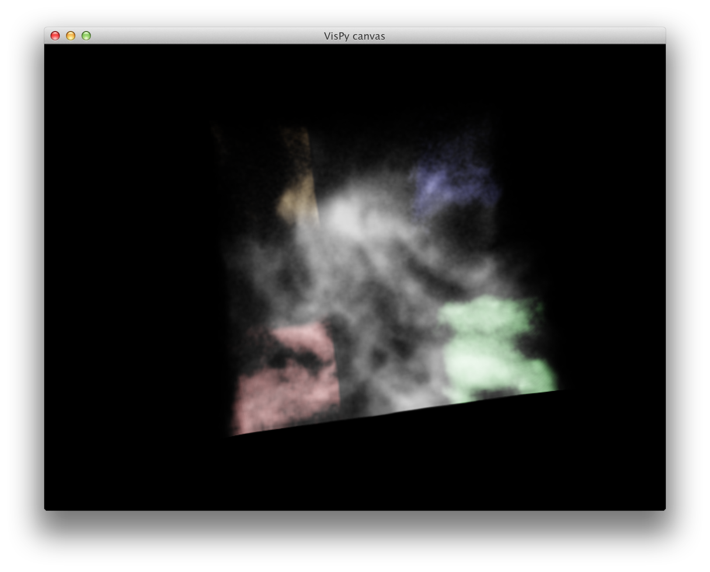

About
-----

This repository includes experiments of ways to display multiple volumes in
volume renderings using OpenGL with VisPy.



### Approach 1 - MultiVolumeVisual

This implements a ``MultiVolumeVisual`` and a ``MultiVolume`` class for
[VisPy](http://www.vispy.org) which allows multiple volumes to be shown
simultaneously.

Simply use the ``MultiVolume`` class as you would use the ``Volume`` class in
[VisPy](http://www.vispy.org), but instead of passing the volume data,
``clim``, and ``cmap`` as separate arguments, the first argument should be a
list of tuples, where each tuple contains ``(data, clim, cmap)``.

In future it should be possible to also add extra tuples to the ``volumes``
attribute of the ``MultiVolume`` on-the-fly.

You can try the two examples in the repository by running:

```
python medical.py
```

and

```
python astrocube.py
```

The approach here is to make it so that the vertex shader includes variables
for separate volumes and colormaps, and the color averaging is done in the
shader itself. The ``MultiVolumeVisual`` class then includes a list of volumes
that is a callback-enabled list: every time an item is added or removed from
the list, the OpenGL data buffer for that item is updated.

**Pros:** when adding a new volume, we don't have to resend all the data, we
simply add the new volume data, and update the volume counter in OpenGL. In
addition, the averaging is done on-the-fly in OpenGL and seems to be very fast.

**Cons:** the fragment shader code has to be generated for a fixed maximum
number of volumes. We could consider making it so that when more than this
value of volumes are added, we update the fragment shader code, but this is not
ideal.

### Approach 2 - RGBAVolumeVisual

This implements a ``RGBAVolumeVisual`` and a ``RGBAVolume`` class for
[VisPy](http://www.vispy.org) which allows a cube with arbitrary colors in each
pixel to be shown. This in turn can then be used to show multiple volumes,
since we can pre-compute the full final RGBA cube in Python before passing it
to VisPy.

This works by simply setting ``u_volumetex`` to an actual 4-d RGBA cube instead
of a 3-d array, and then using these values without mapping with a colormap.

You can try the two examples in the repository by running:

```
python medical_rgba.py
```

and

```
python astrocube_rgba.py
```

**Pros:** could actually be implemented in VisPy with minimal effort (a few
lines) on top of the existing Volume.

**Cons:** combining the volumes has to be done in Python, and may therefore be
slower.